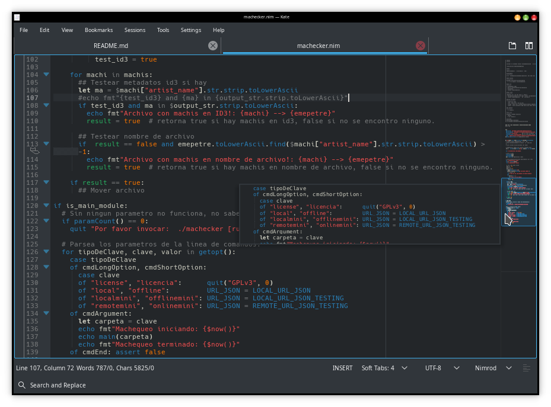

# Kate ♥ Nim

[Nim](http://nim-lang.org) language support and colors for [Kate](http://www.kde.org/applications/utilities/kate/).

# Screenshots

# Install

This does NOT require KatePart5 installed, works Ok with Kate only.

- **Syntax**: Save XML file to `"~/.local/share/org.kde.syntax-highlighting/syntax/nim.xml"`
- **Indent**: Save JS file to `"~/.local/share/org.kde.script/indentation/nim.js"`
- **Colors**: Kate > Settings > Configure Kate > Fonts & Colors > (Schema) Import...

# License

All code is released under [WTFPL](http://www.wtfpl.net/) unless explicitly stated otherwise.

[Original Repo (Dead)](https://github.com/PhilipWitte/NimKate#kate-s-nimrod)
